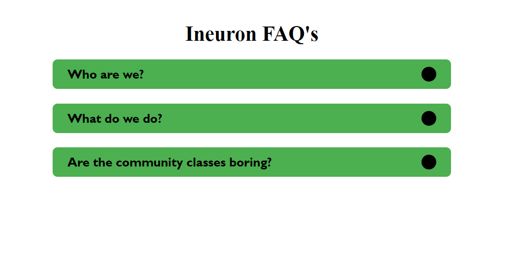
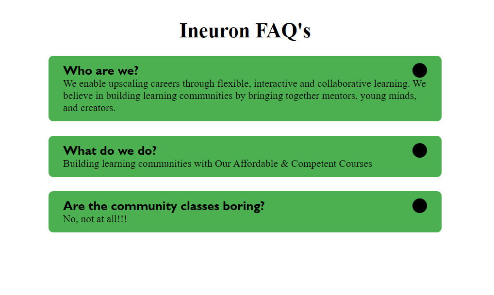

# Accordian 

``` An accordion is used to show (and hide) HTML content.```








# Contact Me 

[](https://www.instagram.com/abhishekaslk/)

[](https://twitter.com/AbhishekASLK)

[](https://github.com/AbhishekASLK)

[](https://www.linkedin.com/in/abhishekaslk/)

